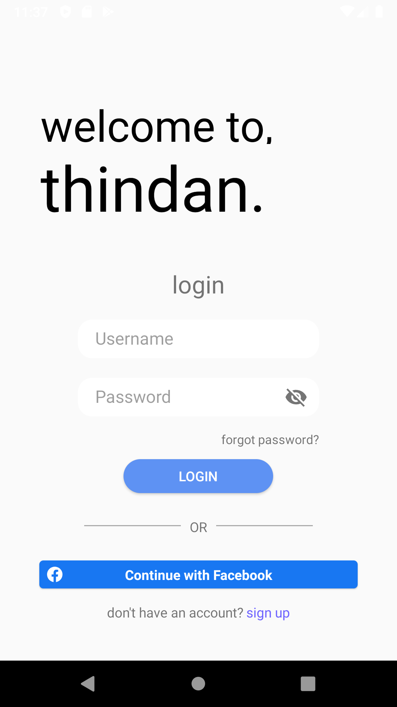
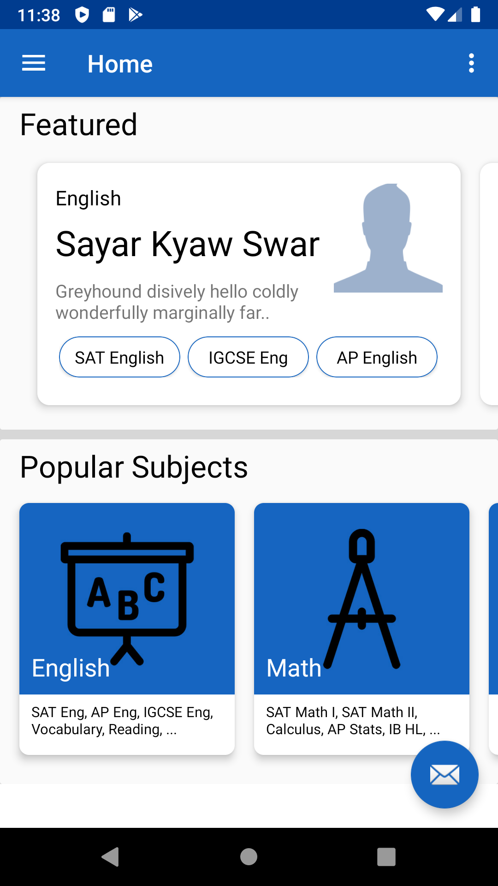
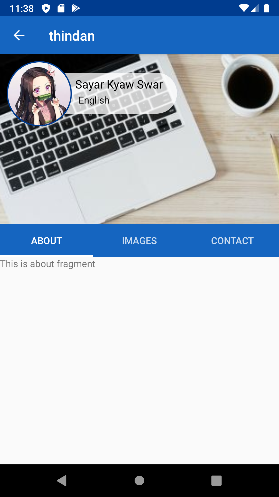

# ThinDan
Social platform with the aim of connecting tutors and students in Myanmar

## Problem
Education in Myanmar has always been a top priority among students and parents of all types of demographics. Private supplemental tutoring especially in Myanmar is a very booming and traditional part of Myanmar's education sector with more than 85% of all students recieving tutoring outside of school. In a [research](https://unesdoc.unesco.org/in/documentViewer.xhtml?v=2.1.196&id=p::usmarcdef_0000373594&file=/in/rest/annotationSVC/DownloadWatermarkedAttachment/attach_import_6879a23d-e20b-46f3-b997-2e5628bb87ba%3F_%3D373594eng.pdf&locale=en&multi=true&ark=/ark:/48223/pf0000373594/PDF/373594eng.pdf#%5B%7B%22num%22%3A39%2C%22gen%22%3A0%7D%2C%7B%22name%22%3A%22XYZ%22%7D%2C55%2C838%2C0%5D) conducted by the Comparative Education Research Center of UNESCO on shadow education in Myanmar, the results show that despite private tutoring's implications, in societies like Myanmar, this was a system that was not going to leave. Consequently, there is still a wide potential for the education sector to utilize and modernize the way this tutoring ecosystem works, with the aim of promoting the positives of learning and providing incomes for private tutors. 

From our own personal and other anecdotal experiences, we realized that there were several inefficiencies in the tutoring business. 
  * New tutors are unable to enter and compete in a market that usually relies on word of mouth for advertising and gaining new students. 
  * Students/parents often find themselves moving constantly from tutor to tutor trying different recommendations, but not finding or achieving the results that they want. 
  * Students/parents cannot easily gauge the abilities of the tutor before hiring them, and can only trust the words of the person who recommended them.
  * There are great tuition centers that have the means to advertise and market themselves, but often even these great tuition centers are unknown to many that may need them. 
  * It is hard to compare price rates, number of students, availabilities, and other metrics that are important to consider between tutors. 

## Solution
In lieu of these inefficiencies, Thindan aims to provide an easily accessible social platform where tutors and students can connect at a click of a button. With an emphasis on convenience through communication, Thindan provides a medium where private tutors and tutoring centers can advertise and market their services for students, and students/parents can have a wide range of options to consider and compare. 

In consideration of the popularity of android phones in Yangon's general populace, and in consideration of the fact that the technologically developing society may require some time adopting the use of web applications, we decided that creating an Android Application would be the best approach for this project. 

## Goals
* Help grow existing tutoring services in the market, and encourage and aid new tutors entering the market.
* Replace the often unreliable word-of-mouth system, with a fast and reliable social platform. 
* Provide students/parents with insightful recommendations and reviews to help make the search for tutors easier. 
* Optimize and promote communications between private tutors and prospective students through instant messaging. 
* And more!

## Milestones
- [x] Iteration 1
  - Basic UI
  - Assembling a team of devs and designers
  - User authentication
- [ ] Iteration 2
  - Basic functionalities
  - NodeJS and MongoDB backend
  - UI/UX revamp
  - Graphics
- [ ] Iteration 3
  - More Info Coming Soon...

## UI Examples
While this project is still under development, here are some snapshots of the current UI :). 

<kbd></kbd> &nbsp;&nbsp; <kbd></kbd> &nbsp;&nbsp; <kbd></kbd>

## Team
**@khantk** Lead Android Developer (Frontend/Backend)
**@tripletk** Android Developer
**@stevenchang805** Android Developer
**Wai Yan Naing** Graphic Designer
